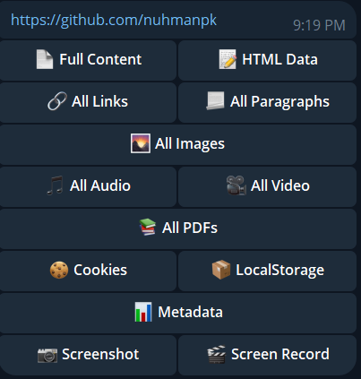
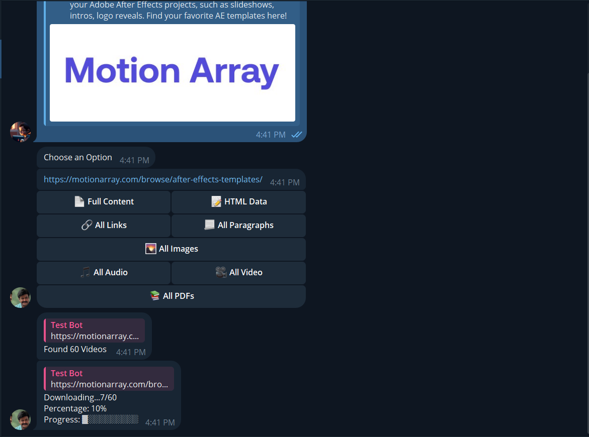

# WebScrapperRoBot
Simple , powerful and versatile web scraping tool designed to simplify the process of extracting data from websites. It features a user-friendly menu-driven interface and supports a wide range of data extraction options, including raw HTML, HTML elements, paragraphs, links, audios, and videos

**_NOTE:_** New Patch supports web crawling.

Scraping Options:

1. **Full Content**
1. **HTML Data**
1. **All Links**
1. **All Paragraphs**
1. **All Images**
1. **All Audio**
1. **All Video**
1. **All PDFs**
1. **Cookies**
1. **LocalStorage**
1. **Metadata**
1. **Web ScreenShot\***
1. **Web Recording\***
1. **Web Crawler**
1. **Got Something New? Add [here](https://github.com/nuhmanpk/WebScrapper/fork)**

*These features are still under development 






## Run Bot in Google Colab for free

[](https://colab.research.google.com/github/nuhmanpk/WebScrapper/blob/main/WebScrapper.ipynb)

## Key Features:
User-Friendly Menu-Driven Interface: Navigate easily through the bot's features using a simple and intuitive menu system.

Comprehensive Data Extraction: Extract a variety of data types, including raw HTML, HTML elements, paragraphs, links, audios, and videos.

Robust Error Handling: Handle unexpected errors and receive informative error messages to identify and resolve issues.

## Use Cases:
Gather information from websites for research or analysis.

Monitor competitor prices and product information.

Collect data for marketing and lead generation.

Extract news articles or social media posts for sentiment analysis.

# Setting Up a Project and Configuring Environment Variables

To set up the project and configure environment variables, follow these steps:

### 1. Clone the Repository

Clone the project's repository from your preferred version control platform (e.g., Git) to your local machine.

```bash
git clone https://github.com/nuhmanpk/WebScrapper.git
```

### 2. Virtual Environment (Optional)

It's a good practice to create a virtual environment for the project. You can use virtualenv or venv for this purpose.

```bash
python -m venv venv
source venv/bin/activate  # On Unix/Linux systems
```

3. Install Dependencies
Use pip to install the project is dependencies from the requirements.txt file.

```bash
pip install -r requirements.txt
```
4. Create the .env File
Create a .env file in the project is root directory. This file will contain the necessary environment variables. You can either copy a sample file or create it manually.

5. Configure Environment Variables
Open the .env file and set the required environment variables in the format VARIABLE_NAME=value. For example:

```env
BOT_TOKEN=your_bot_token_here
API_ID=your_api_id_here
API_HASH=your_api_hash_here
```
6. Run the Project
Execute the project using the appropriate command (e.g., python my_project.py) and access your environment variables in the code to retrieve configurations.

7. Consider Secret Management (Optional)

If you deploy your project on a cloud server, consider using a secrets manager like AWS Secrets Manager, Google Secret Manager, or a similar service. This will help you securely store your configurations in a production environment.

## What is Web Scraping ?
  Web scraping, web harvesting, or web data extraction is data scraping used for extracting data from websites. The web scraping software may directly access the World Wide Web using the Hypertext Transfer Protocol or a web browser.
## Is web scraping Legal?
  Web scraping itself is not illegal. As a matter of fact, web scraping – or web crawling, were historically associated with well-known search engines like Google or Bing. These search engines crawl sites and index the web. ... A great example when web scraping can be illegal is when you try to scrape nonpublic data.
## Why web scraping is Done?
  Web scraping is used in a variety of digital businesses that rely on data harvesting. Legitimate use cases include: Search engine bots crawling a site, analyzing its content and then ranking it. ... Market research companies using scrapers to pull data from forums and social media (e.g., for sentiment analysis).
## Where can I use web scraping?
  Lead Generation for Marketing. A web scraping software can be used to generate leads for marketing,Price Comparison & Competition Monitoring,E-Commerce,Real Estate,Data Analysis,Academic Research,Training and Testing Data for Machine Learning Projects,,Sports Betting Odds Analysis.
## Are there any Limitations?
   Learning curve, Even the easiest scraping tool takes time to master,The structure of websites change frequently,Scraped data is arranged according to the structure of the website,It is not easy to handle complex websites,To extract data on a large scale is way harder,A web scraping tool is not omnipotent

[Take a Demo Here](https://t.me/WebScrapperRoBot)

## Ethical Considerations

Respect the rights of website owners: Website owners have the right to control how their content is used. Scraping a website without permission can be considered trespassing or copyright infringement.

Don't overload websites: Scraping a website too frequently can overload its servers and make it unavailable to other users. Be mindful of the website's load when scraping data.

Use robots.txt: Robots.txt is a file that website owners can use to specify which pages they do not want scraped. Respect the robots.txt file and avoid scraping pages that are disallowed.

Identify yourself as a scraper: When scraping a website, identify yourself as a scraper in your user agent string. This will help website owners to understand who is accessing their site and for what purpose.

Be transparent about your intentions: If you are scraping a website for commercial purposes, be transparent about your intentions. This will help to build trust with website owners and users.

## Safety Guidelines

Never scrape personal information: Scraping personal information, such as names, addresses, and email addresses, is a violation of privacy. Never scrape personal information without the explicit consent of the individuals involved.

Avoid scraping sensitive data: Avoid scraping data that could be used to harm individuals or organizations, such as financial information, medical records, or trade secrets.

Be cautious about scraping social media: Social media platforms have their own terms of service that govern how data can be scraped. Be sure to comply with these terms of service when scraping social media data.

## Contributors


## Support

Show your support [here](https://github.com/sponsors/nuhmanpk)

<Br><b>Mark your Star [⭐⭐](https://github.com/nuhmanpk/WebScrapper/stargazers)<b>
